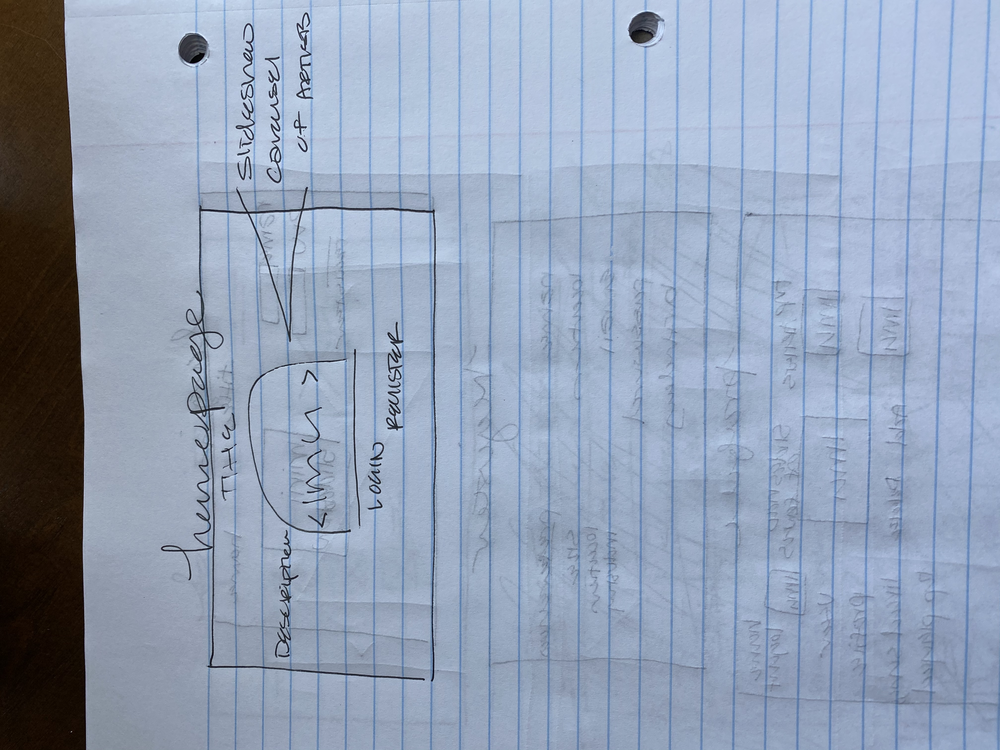
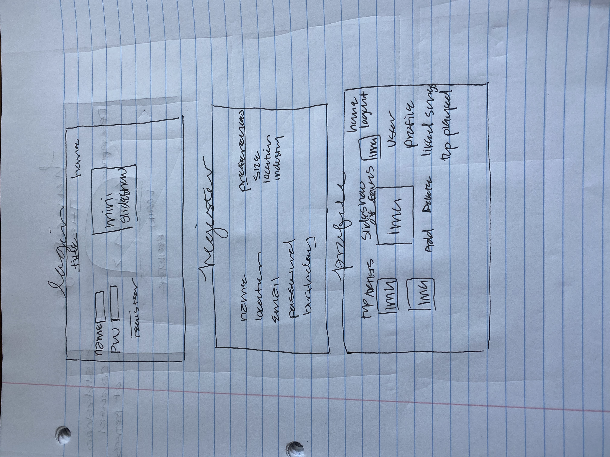
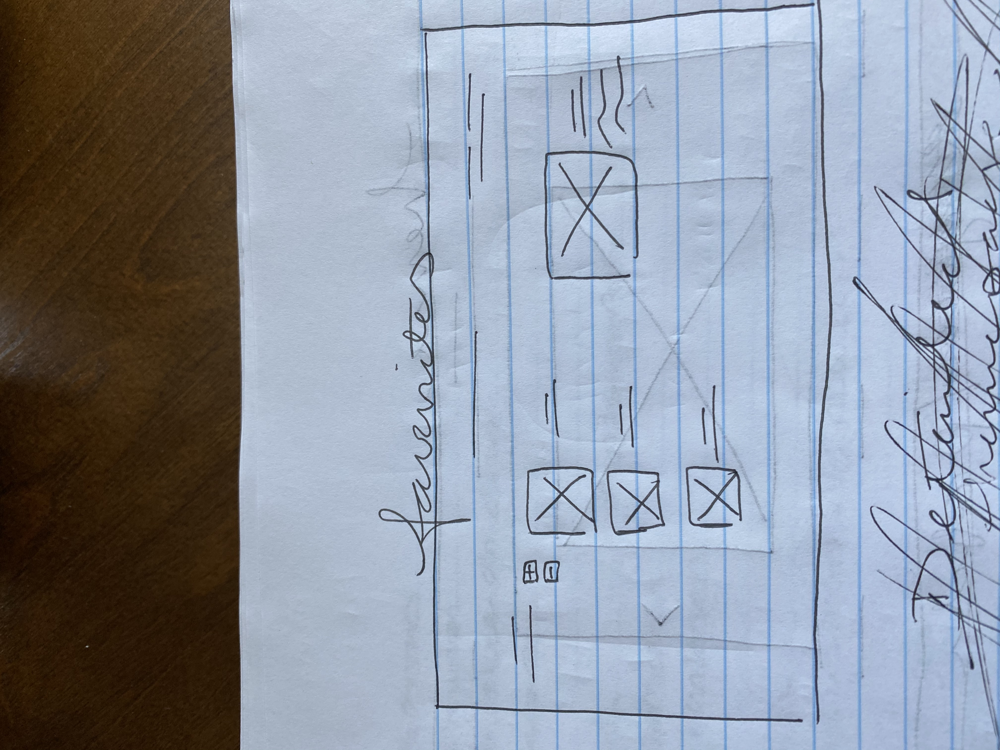
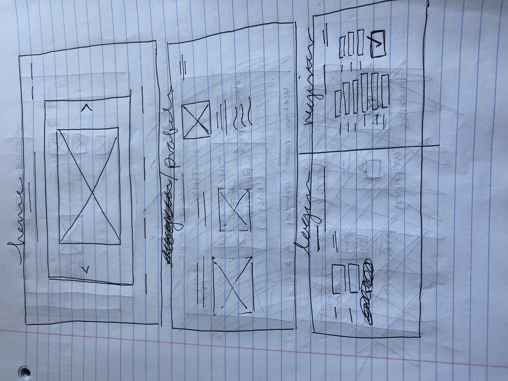
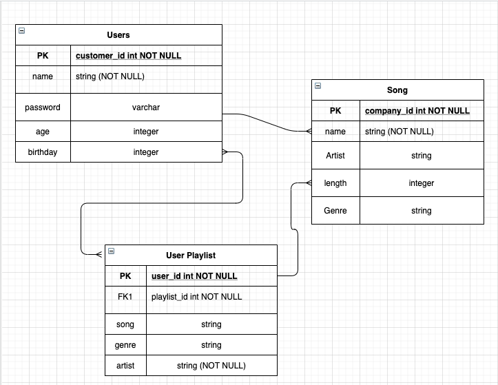
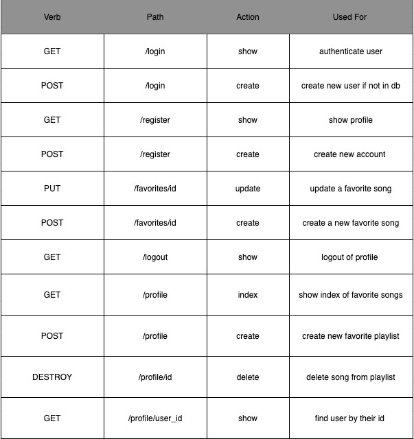

## Jukebox

## MVP 

## homepage 
- [x] a homepage with a Jukebox in the background 
- [X] a login button for users 
- [X] a register button for users 
- [X] a description for what you can do with the application 

## login 
- [X] a section that allows you to enter your username 
- [X] section that prompts you to enter your password
- [X] a message that will flash whether or not you have entered the right credentials 
- [X] a button that allows you to register if you haven't created an account 

## register 
- [X] a form with the following
    - [X] name
    - [X] password
    - [X] email
    - [X] birthday
    - [X] location
- [X] message that flashes once the profile has been created 

## profile 
- [X] will show playlist created of favorite songs
- [/] will have an option for you to add another song
- [/] will give you the ability to delete a song from your playlist 
- [ ] ability to search for a specific song by id 

## FLEXIN

## homepage
- [X] include anime.js on the homepage somehow
- [ ] create a carousel effect with artists albums

## login
- [ ] hover prompt for password criteria 

## register 
- [ ] verify password check

## profile
- [X] will show a picture of you
- [X] will show your profile info (birthday, location, etc.)
- [ ] ability to search for user with specific id

## citations

- [ ] https://developer.spotify.com/documentation/general/guides/authorization-guide/
- [ ] https://www.npmjs.com/package/node-spotify-api
- [ ] https://stackoverflow.com/questions/15175312/increase-font-size-of-hyperlink-text-html
- [ ] https://animejs.com/
- [ ] https://www.pexels.com/photo/closeup-photography-of-jukebox-21088/