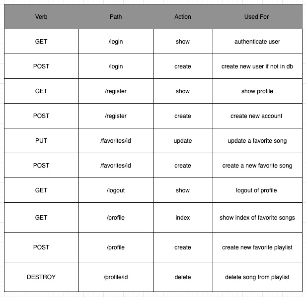

## Jukebox

## MVP 

## homepage 
- [ ] a homepage with a Jukebox in the background 
- [ ] a login button for users 
- [ ] a register button for users 
- [ ] a description for what you can do with the application 

## login 
- [ ] a section that allows you to enter your username 
- [ ] section that prompts you to enter your password
- [ ] a message that will flash whether or not you have entered the right credentials 
- [ ] a button that allows you to register if you haven't created an account 

## register 
- [ ] a form with the following
    - [ ] name
    - [ ] password
    - [ ] email
    - [ ] birthday
    - [ ] location
- [ ] message that flashes once the profile has been created 

## profile 
- [ ] will show playlist created of favorite songs
- [ ] will have an option for you to add another song
- [ ] will give you the ability to delete a song from your playlist 
- [ ] ability to search for a specific song by id 
- [ ] ability to search for user with specific id

## FLEXIN

## homepage
- [ ] include anime.js on the homepage somehow
- [ ] create a carousel effect with artists albums

## login
- [ ] hover prompt for password criteria 

## register 
- [ ] verify password check

## profile
- [ ] will show a picture of you
- [ ] will show your profile info (birthday, location, etc.)